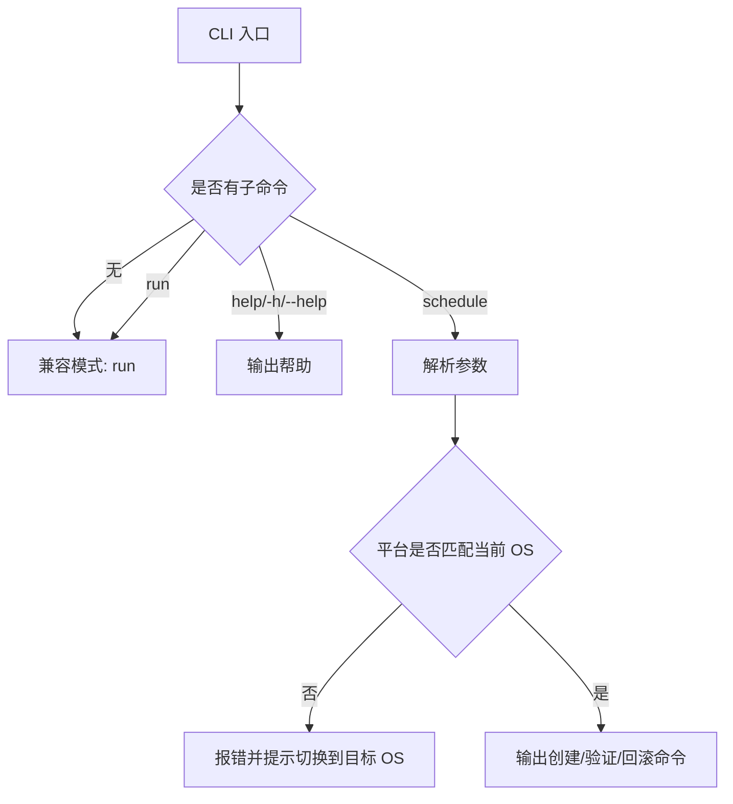

## CLI 子命令说明

### 职责

| 子命令 | 职责 | 输入 | 输出 | 依赖 | 关键约束 |
| --- | --- | --- | --- | --- | --- |
| `run` | 执行现有自动阅读主流程 | 环境变量 | 控制台日志、截图、邮件、Bark | `selenium-webdriver`、邮件/Bark 配置 | 保持现有主流程行为 |
| `schedule` | 生成周期性计划任务命令 | `--name` `--every` `--workdir` `--platform` `--weread-duration` `--dry-run` | 创建命令、验证命令、回滚命令、权限提示 | `schtasks` / `launchctl` / `systemd --user` | 仅支持向 `run` 追加 `--weread-duration`；`--workdir` 可选，默认当前用户 `HOME` |
| `help` / `-h` / `--help` | 输出 CLI 帮助 | 可选子命令名 | 帮助文本 | 无 | 不触发主流程 |

### 调度实现

| 平台 | 落地方式 | 创建内容 | 验证方式 | 回滚方式 |
| --- | --- | --- | --- | --- |
| `windows` | `schtasks` | 周期性 Task Scheduler 任务 | `schtasks /Query` | `schtasks /Delete` |
| `macos` | `launchd` | `~/Library/LaunchAgents/*.plist` | `launchctl list` + `plutil -lint` | `launchctl unload` + 删除 plist |
| `linux` | `systemd --user` | `~/.config/systemd/user/*.service` + `*.timer` | `systemctl --user status/list-timers` | `systemctl --user disable --now` + 删除 unit |

### 流程

### 关键约束

| 约束 | 说明 |
| --- | --- |
| 兼容入口 | 无参数仍直接运行主流程，避免打断现有调用方，同时打印迁移提示 |
| 兼容命令名 | `weread-selenium-cli` 为主命令，旧命令 `weread-challenge` 继续可用并指向同一入口 |
| 帮助优先 | `help`、`-h`、`--help` 均可直接查看帮助 |
| `run` 参数优先级 | `run` 子命令参数优先于同名环境变量，其次才回退到默认值 |
| 默认工作目录 | `schedule` 未显式传 `--workdir` 时，默认使用当前用户 `HOME` |
| 当前平台生成 | `schedule` 只在当前平台生成命令，不能用 Windows 进程生成 macOS/Linux 的真实任务 |
| 输出而非执行 | `schedule` 永远只输出命令，不直接注册系统计划任务 |
| `schedule` 运行参数 | `schedule` 只允许附加 `--weread-duration`，其余 `run` 参数必须通过环境变量提供 |
| Windows 重复持续时间 | Windows `schedule` 固定输出 `/DU 8760:00`，以满足 `schtasks` 对 `/RI` 的要求 |
| 权限提示 | Windows 创建命令若报 `Access is denied`，需在管理员终端中执行 |
| 默认数据目录 | 未设置 `WEREAD_DATA_DIR` 时，优先使用已存在的 `.weread`，其次复用已存在的 `data`，否则新建 `.weread` |

### `run` 参数映射

| 参数 | 对应环境变量 | 说明 |
| --- | --- | --- |
| `--weread-browser` | `WEREAD_BROWSER` | 浏览器类型 |
| `--weread-duration` | `WEREAD_DURATION` | 阅读分钟数 |
| `--weread-selection` | `WEREAD_SELECTION` | 书籍选择序号 |
| `--weread-remote-browser` | `WEREAD_REMOTE_BROWSER` | 远程 Selenium 地址 |
| `--enable-email` | `ENABLE_EMAIL` | 邮件通知开关 |
| `--email-smtp` 等邮件参数 | `EMAIL_*` | SMTP 主机、账号、密码、发件人与收件人 |
| `--bark-key` / `--bark-server` | `BARK_*` | Bark 推送配置 |
| `--weread-data-dir` | `WEREAD_DATA_DIR` | 数据目录；未显式配置时按 `.weread` -> `data` -> 新建 `.weread` 的顺序解析 |

`run` 同时接受 kebab-case 参数和原始环境变量名参数，例如 `--weread-browser firefox` 与 `--WEREAD_BROWSER firefox` 等价。
