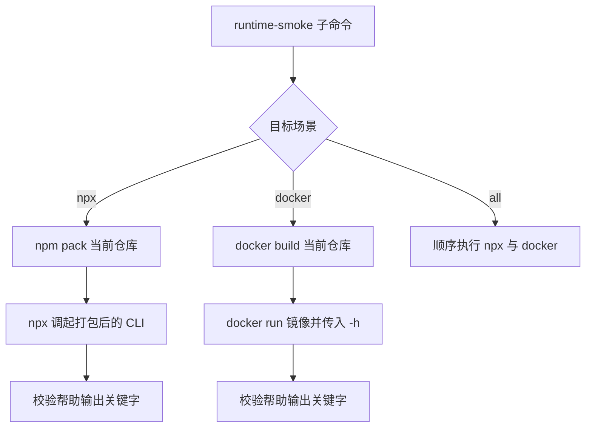

## 运行 Smoke 说明

### 职责

| 组件 | 职责 | 输入 | 输出 | 依赖 | 关键约束 |
| --- | --- | --- | --- | --- | --- |
| `scripts/runtime-smoke.js npx` | 验证当前仓库打包后可被 `npx` 正常调起 | 当前仓库源码、`npm`、`npx` | CLI 帮助输出、通过/失败状态 | Node.js、npm | 只验证入口可执行与帮助输出，不触发真实阅读流程 |
| `scripts/runtime-smoke.js docker` | 验证当前 `Dockerfile` 构建出的镜像可正常启动 CLI | 当前仓库源码、Docker daemon | 镜像构建日志、容器帮助输出、通过/失败状态 | Docker | 通过 `docker run --rm <image> node app.js -h` 验证镜像内 CLI，不依赖扫码登录或远程 Selenium |
| `scripts/runtime-smoke.js all` | 串行执行两条核心运行路径 | 同上 | 汇总通过/失败状态 | Node.js、npm、Docker | 任一场景失败即退出非 0 |

### 流程

### 关键约束

| 约束 | 说明 |
| --- | --- |
| 验证边界 | 只验证“入口可执行”，不做真实登录、扫码、阅读或计划任务注册 |
| `npx` 来源 | `npx` 验证基于 `npm pack` 产出的当前仓库 tarball，而不是依赖线上 npm 最新版本 |
| 容器来源 | Docker 验证基于当前工作树里的 `Dockerfile` 本地构建镜像 |
| 清理规则 | smoke 会清理临时打包目录，并在 Docker 场景结束后删除临时镜像 |
